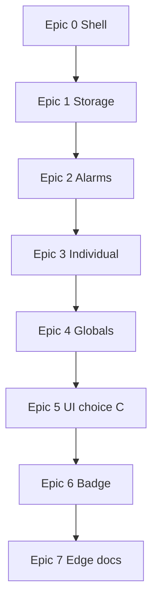

# URL Auto Refresher — product plan

Manifest V3 Edge extension: **global sync groups** vs **individual jobs**, jittered intervals, **target URL per tab**, Side Panel + full-page **dashboard**, and a **focus-aware** toolbar badge. Unified browse/edit UI opens from the toolbar.

**How to use this doc:** Check off stories (`[x]`) as you ship them. Epics build top-to-bottom (see dependency diagram at the bottom).

---

## Progress overview

| Epic | Theme | Stories |
|------|--------|--------|
| [x] **0** | Extension shell & entry | 3 |
| [x] **1** | Data model & persistence | 3 |
| [x] **2** | Scheduling (service worker) | 4 |
| [ ] **3** | Individual jobs (vertical slice) | 3 |
| [ ] **4** | Global groups | 3 |
| [ ] **5** | Unified UI (choice C) | 4 |
| [ ] **6** | Toolbar badge (focus-aware) | 3 |
| [ ] **7** | Ship notes for Edge | 2 |

*(Optional: set an epic row to `[x]` when **all** its stories are done.)*

---

## Epic 0 — Extension shell and entry point

**Goal:** Installable unpacked extension; toolbar opens the real “settings / overview” surface; Side Panel path exists for choice **C**.

- [x] **0.1** — MV3 `manifest.json`: `background` service worker, `action`, `side_panel`, dashboard/options page, icons, permissions (`storage`, `alarms`, `tabs`, `windows`, `sidePanel`, broad `https` hosts). *Outcome: loads in Edge without errors.*
- [x] **0.2** — **Toolbar click → full-page dashboard** as primary overview (not popup-only MVP). *Outcome: icon opens unified browse/edit surface.*
- [x] **0.3** — Stub Side Panel path + affordance for “open side panel” (second entry). *Outcome: choice **C** skeleton.*

---

## Epic 1 — Data model and persistence

**Goal:** Typed state in `chrome.storage.local`; validation; no double enrollment for the same tab.

- [x] **1.1** — Read/write `GlobalGroup[]` and `IndividualJob[]` (per [data sketch](#data-sketch-illustrative)). *Outcome: survives browser restart.*
- [x] **1.2** — Validation helpers: URL (`http`/`https`), positive interval, non-negative jitter, unique ids. *Outcome: bad input rejected before save.*
- [x] **1.3** — **Mutual exclusion:** a tab cannot be active in two places (two globals, or global + individual). *Outcome: no double `tabs.update` for the same tab; surface clear errors in dashboard UI as you build Epic 3+.*

---

## Epic 2 — Scheduling engine (service worker)

**Goal:** `chrome.alarms` backbone, jittered reschedule, `nextFireAt` in storage, safe tab lifecycle.

- [x] **2.1** — One alarm per **individual** job: on fire → `tabs.update(tabId, { url: targetUrl })`, then reschedule with **base + uniform jitter**. *Outcome: one individual refresh loop works.*
- [x] **2.2** — After each schedule, persist **`nextFireAt`** for UI countdowns. *Outcome: storage + alarms stay aligned.*
- [x] **2.3** — `tabs.onRemoved` / invalid tab → disable or prune job; `tabs.update` must not throw. *Outcome: clean failure modes.*
- [x] **2.4** — **Global group:** one alarm per group; on fire, `tabs.update` **all** targets together; one new jittered delay for the **group**. *Outcome: synchronized refresh.*

---

## Epic 3 — Individual jobs (vertical slice)

**Goal:** First end-to-end workflow without globals.

- [ ] **3.1** — Dashboard: **add Individual job** — pick tab, set `targetUrl`, interval, jitter, Save. *Outcome: first usable path.*
- [ ] **3.2** — Start / Stop, edit, delete individuals; **one countdown row** per job. *Outcome: full individual lifecycle.*
- [ ] **3.3** — Extract shared **list row** component for Epic 5. *Outcome: less duplication before Global UI.*

---

## Epic 4 — Global groups

**Goal:** Build globals from real windows/tabs; match product model; safe moves vs individuals.

- [ ] **4.1** — **Window/tab browser:** `windows.getAll({ populate: true })`, checklist of tabs, per-row `targetUrl`. *Outcome: real multi-window global groups.*
- [ ] **4.2** — Create / edit / delete globals; **Global (N)** header, shared countdown, group start/stop. *Outcome: globals behave per spec.*
- [ ] **4.3** — Enforce mutual exclusion when moving a tab between individual and global. *Outcome: safe transitions.*

---

## Epic 5 — Unified UI (choice C) and two lists

**Goal:** **Global (N)** and **Individual (M)** everywhere; dashboard + side panel share modules.

- [ ] **5.1** — Dashboard: both section headers with counts; browse-all layout. *Outcome: matches **1b** / overview mental model.*
- [ ] **5.2** — Side Panel: same lists via shared JS/CSS. *Outcome: quick monitoring without full tab.*
- [ ] **5.3** — Cross-links: dashboard ↔ side panel (“open in other surface”). *Outcome: coherent choice **C**.*
- [ ] **5.4** — Live countdown in UI (`storage` + `runtime` messages or ~1s polling while visible). *Outcome: rows tick smoothly.*

---

## Epic 6 — Toolbar badge (focus-aware)

**Goal:** Badge reflects **focused** window’s timers as far as the platform allows.

- [ ] **6.1** — Build **focused-window** job set: `windowId` → relevant individuals + globals touching that window. *Outcome: correct subset for badge math.*
- [ ] **6.2** — Badge = time to **nearest** `nextFireAt` in that subset; idle (e.g. `×`) when none; optional **fallback** when focused window has no jobs (product decision — document in README). *Outcome: best possible “per-window” feel.*
- [ ] **6.3** — Subscribe to focus/tab events + alarm completions; avoid busy loops. *Outcome: badge stays current without draining CPU.*

---

## Epic 7 — Ship notes for Edge

**Goal:** Someone can install, understand limits, and regress manually.

- [ ] **7.1** — README: load unpacked, permissions, **focus-aware badge vs tiled windows** (one shared `chrome.action` badge). *Outcome: install + explain.*
- [ ] **7.2** — Manual QA script from [Testing checklist (manual)](#testing-checklist-manual) + multi-window scenarios. *Outcome: regression path for releases.*

---

## Reference — goals vs approach

| Requirement | Approach |
|-------------|----------|
| Install in Edge | MV3; load unpacked or publish to Edge Add-ons. |
| Refresh a **fixed target URL** per tab | Store `targetUrl` per tab; tick → `chrome.tabs.update(tabId, { url: targetUrl })`. |
| Base interval + jitter | `nextDelayMs = baseMs + uniform offset in [-jitterMs, +jitterMs]`; reschedule after each fire. |
| Icon shows status | **Focus-aware** badge (nearest `nextFireAt` for **focused** window’s jobs); full UI lists every job. |
| Multi-window, one place | `chrome.storage` + `windows.getAll({ populate: true })` when picking targets. |

---

## Reference — Toolbar, badge, settings

- **Toolbar click** opens the **full-page dashboard** (browse every global set and individual job).
- **Product goal:** Badge feels tied to the **focused** window — recompute on `windows.onFocusChanged` / `tabs.onActivated`: nearest `nextFireAt` among jobs for that window (individuals in that window + globals that include a tab there). Compact text (e.g. minutes or `m:ss`); idle (e.g. `×`) when no jobs. Optional fallback if focused window has no jobs: nearest refresh **across all** jobs (document in README).
- **Platform limit:** `chrome.action` has **one** badge per profile — all toolbars show the **same** text; tiled windows still mirror the **focused** window’s countdown, not two different numbers. Per-window numbers without hacks would need e.g. a content-script overlay (out of scope unless you add it later).
- Full per-row countdowns live in **Side Panel + dashboard** (choice **C**).

---

## Reference — Clarifications (1, 1a–1c)

- **Global vs Individual:** From any window, choose **Global** (shared clock for included tabs) or **Individual** (separate timers). Same data via `chrome.storage`.
- **1a:** One alarm + one `nextFireAt` per **global** group; tabs refresh together. **Individual** jobs have separate alarms/countdowns.
- **1b:** UI always shows **Global (N)** and **Individual (M)** with counts.
- **1c:** Every row shows a **next-refresh** countdown (one per global group; one per individual). Badge uses focus-aware rules above.

---

## Reference — Core product model (short)

1. **Global groups** — Named targets; **one** schedule per group; on fire, refresh all targets **at once**, each with its own `targetUrl`.
2. **Individual jobs** — Own schedule; edits don’t affect globals.
3. **Two lists everywhere** — Same structure in Side Panel and dashboard.
4. **UI mode** — Clear Global vs Individual flow; **at most one** active enrollment per `tabId` (global or individual).

---

## Reference — Scheduling (MV3-safe)

- **`chrome.alarms`:** one alarm per global group and one per individual (namespaced ids).
- On fire: run refresh(es), compute new delay with jitter, recreate alarm.
- **`nextFireAt`** in storage for UI; optional short-interval tick **only while** a surface is visible — alarms + stored times remain source of truth.

---

## Reference — Permissions

- `storage`, `alarms`, `tabs`, `windows`, `sidePanel`
- Host: `http://*/*`, `https://*/*` (or `<all_urls>`) for arbitrary navigation targets.

---

## Reference — UI deliverables (choice C)

1. **Side Panel** — Both lists, counts, countdowns, start/stop; `chrome.sidePanel.setOptions` + entry affordances as needed.
2. **Full-page dashboard** — Same model; more room for editing targets, URLs, intervals, jitter, membership.

Shared: one module for list rendering + validation (URL, interval, jitter).

---

## Data sketch (illustrative)

```ts
type TargetRef = { tabId: number; windowId: number; targetUrl: string; label?: string };

type GlobalGroup = {
  id: string;
  name: string;
  targets: TargetRef[];
  baseIntervalSec: number;
  jitterSec: number;
  enabled: boolean;
  nextFireAt?: number;
};

type IndividualJob = {
  id: string;
  target: TargetRef;
  baseIntervalSec: number;
  jitterSec: number;
  enabled: boolean;
  nextFireAt?: number;
};
```

Enforce **non-overlap:** same `tabId` cannot be enabled in two places.

---

## Edge packaging

- **Load unpacked** from `edge://extensions` with Developer mode.
- Same ZIP/CRX flow as Chrome if you publish to [Microsoft Edge Add-ons](https://microsoftedge.microsoft.com/addons/Microsoft-Edge-Extensions-Home).

---

## Testing checklist (manual)

- [ ] Two windows, two different `targetUrl`s in **one global group** → both refresh **together**; live URL may differ until refresh.
- [ ] **Individual** in window A while **global** runs in B/C → independent timers.
- [ ] Service worker restarts → alarms still fire; `nextFireAt` matches alarms.
- [ ] Tab closed → job disabled or removed; no error on `tabs.update`.

---

## Out of scope / follow-ups

- **Different badge text on two visible windows at once:** not supported by `chrome.action`; optional later: per-tab overlay (content script).

---

## Dependency diagram


