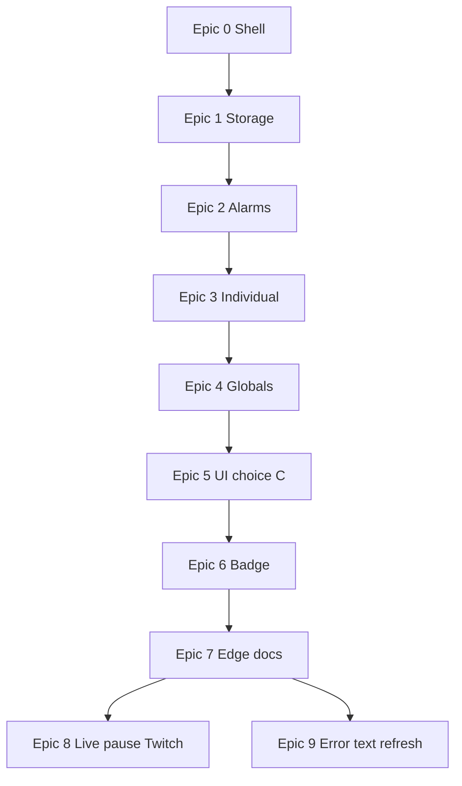

# URL Auto Refresher — product plan

Manifest V3 Edge extension: **global groups** (shared interval policy, **per-tab** staggered refresh—not Chrome account sync) vs **individual jobs**, jittered intervals, **target URL per tab**, Side Panel + full-page **dashboard**, and a **focus-aware** toolbar badge. Unified browse/edit UI opens from the toolbar.

**How to use this doc:** Check off stories (`[x]`) as you ship them. Epics build top-to-bottom (see dependency diagram at the bottom).

**Source of truth:** This file is the canonical checklist for product epics, reference-UI work, and agent-facing scope notes. Cursor (or other) task lists should stay aligned with the checkboxes here—update this doc when scope changes. **Shipped behavior belongs in the epic/story lines** (below); the [Backlog](#backlog-ux--polish--bugs) section tracks follow-ups and may retain a bullet for traceability, but **if the same work is specified under an epic, the epic line is authoritative**—do not maintain a second, diverging spec in the backlog.

---

## Progress overview

| Epic | Theme | Stories |
|------|--------|--------|
| [x] **0** | Extension shell & entry | 3 |
| [x] **1** | Data model & persistence | 3 |
| [x] **2** | Scheduling (service worker) | 4 |
| [x] **3** | Individual jobs (vertical slice) | 4 |
| [x] **4** | Global groups | 3 |
| [x] **5** | Unified UI (choice C) | 4 |
| [x] **6** | Toolbar badge (focus-aware) | 3 |
| [x] **7** | Ship notes for Edge | 2 |
| [x] **8** | Live-aware pause (Twitch-first) | 3 |
| [x] **9** | Blip / error-text triggered refresh | 3 |
| [x] **Post-9** | Incremental polish (see [Post–Epic 9](#postepic-9--incremental-enhancements-shipped)) | 6 |

*(Optional: set an epic row to `[x]` when **all** its stories are done.)*

---

## Reference UI + agent guidance (checklist)

Third-party UI (**Auto Refresh Plus**–style screenshots) is **inspiration only**—not our branding. Paths: [`doc/ui-reference/README.md`](../ui-reference/README.md) and `doc/ui-reference/auto-refresh-plus/` (PNG files).

**Work items (check off when done):**

- [ ] **Ref.1** — `doc/ui-reference/auto-refresh-plus/` contains the three reference screenshots (`time-interval-tab.png`, `active-tabs-list.png`, `page-monitor-tab.png`) plus [`doc/ui-reference/README.md`](../ui-reference/README.md) describing each file.
- [x] **Ref.2** — [`.cursor/skills/DESIGN_SYSTEM.md`](../../.cursor/skills/DESIGN_SYSTEM.md) points here for UI inspiration and defers to **Borrow vs exclude** below for scope.
- [x] **Ref.3** — [`.cursor/skills/ui-ux/SKILL.md`](../../.cursor/skills/ui-ux/SKILL.md) and [`.cursor/skills/visual-match/SKILL.md`](../../.cursor/skills/visual-match/SKILL.md) mention `doc/ui-reference/README.md` when matching layout or list density to references.

**Borrow from the reference (our product):**

- Clear **primary action** (Start / Stop) and compact navigation (tabs or sections) so the surface stays scannable.
- **Per-row list** for active work: title or label, **URL**, and a **next-refresh countdown** (maps to our `nextFireAt` / UI tick).
- **Large on-page countdown** (Min / Sec digit tiles) for tabs that have an **active** auto-refresh job—**on by default**, with a **dashboard** toggle (`showPageOverlayTimer` in `chrome.storage.local`). Implemented as a content script + shadow DOM (not third-party “page timer” feature parity).
- Interval UX that maps to our model: **base interval + jitter** (seconds)—we do **not** need the reference’s full preset grid, random min/max, or “specific seconds” radio maze unless we choose to add them later.

**Exclude for Epics 0–7 (do not build to match the reference):**

- Hard refresh (bypass cache), cap on number of refreshes, email alerts, XHR-only refresh mode, account / rate-us / promo footer chrome.
- Full **Page Monitor** parity in the core track—that behavior is **Epic 9** (blip / error-text refresh), not Epic 3–5.

**Map reference → our UI:**

| Reference idea | Our plan |
|----------------|----------|
| “Time Interval” tab | Dashboard / side panel: interval + jitter fields per job or group |
| “Active Tabs” list | **Individual** rows (Epic 3+), then **Global** rows (Epic 4+) |
| Large on-page timer card | **Epic 3.0** — our overlay + dashboard toggle (default on) |
| “Page Monitor” (find / lose text) | **Epic 9** — user-defined phrases or regex → trigger refresh |

---

## Epic 0 — Extension shell and entry point

**Goal:** Installable unpacked extension; toolbar opens the real “settings / overview” surface; Side Panel path exists for choice **C**.

- [x] **0.1** — MV3 `manifest.json`: `background` service worker, `action`, `side_panel`, dashboard/options page, icons, permissions (`storage`, `alarms`, `tabs`, `windows`, `sidePanel`, broad `https` hosts). *Outcome: loads in Edge without errors.*
- [x] **0.2** — **Toolbar click → full-page dashboard** as primary overview (not popup-only MVP). *Outcome: icon opens unified browse/edit surface.*
- [x] **0.3** — Stub Side Panel path + affordance for “open side panel” (second entry). *Outcome: choice **C** skeleton.*

---

## Epic 1 — Data model and persistence

**Goal:** Typed state in `chrome.storage.local`; validation; no double enrollment for the same tab.

- [x] **1.1** — Read/write `GlobalGroup[]` and `IndividualJob[]` (per [data sketch](#data-sketch-illustrative)). *Outcome: survives browser restart.*
- [x] **1.2** — Validation helpers: URL (`http`/`https`), positive interval, non-negative jitter, unique ids. *Outcome: bad input rejected before save.*
- [x] **1.3** — **Mutual exclusion:** a tab cannot be active in two places (two globals, or global + individual). *Outcome: no double `tabs.update` for the same tab; surface clear errors in dashboard UI as you build Epic 3+.*

---

## Epic 2 — Scheduling engine (service worker)

**Goal:** `chrome.alarms` backbone, jittered reschedule, `nextFireAt` in storage, safe tab lifecycle.

- [x] **2.1** — One alarm per **individual** job: on fire → `tabs.update(tabId, { url: targetUrl })`, then reschedule with **base + uniform jitter**. *Outcome: one individual refresh loop works.*
- [x] **2.2** — After each schedule, persist **`nextFireAt`** for UI countdowns. *Outcome: storage + alarms stay aligned.*
- [x] **2.3** — `tabs.onRemoved` / invalid tab → disable or prune job; `tabs.update` must not throw. *Outcome: clean failure modes.*
- [x] **2.4** — **Global group:** ~~one alarm per group; synchronized refresh~~ — **superseded (Post–Epic 9):** one alarm **per tab** in the group with **per-tab jitter** and `tabNextFireAt`; each tab refreshes on its own schedule (see [Post–Epic 9](#postepic-9--incremental-enhancements-shipped)). *Outcome: global membership with staggered refreshes.*

---

## Epic 3 — Individual jobs (vertical slice)

**Goal:** First end-to-end workflow without globals.

- [x] **3.0** — **Page overlay timer** — content script shows a large **Min / Sec** countdown on `http`/`https` pages when that tab has an **enabled** individual or global refresh job; **default on**; **dashboard** checkbox turns it off/on (`urlAutoRefresher_prefs_v1`). *Outcome: in-page visibility of time-to-refresh.*
- [x] **3.1** — Dashboard: **add Individual job** — pick tab, set `targetUrl`, interval, jitter, Save. *Outcome: first usable path.*
- [x] **3.2** — Start / Stop, edit, delete individuals; **one countdown row** per job. *Outcome: full individual lifecycle.*
- [x] **3.3** — Extract shared **list row** component for Epic 5. *Outcome: less duplication before Global UI.*

---

## Epic 4 — Global groups

**Goal:** Build globals from real windows/tabs; match product model; safe moves vs individuals.

- [x] **4.1** — **Window/tab browser:** `windows.getAll({ populate: true })`, checklist of tabs, per-row `targetUrl`. *Outcome: real multi-window global groups.*
- [x] **4.2** — Create / edit / delete globals; **Global (N)** header, shared countdown, group start/stop. *Outcome: globals behave per spec.*
- [x] **4.3** — Enforce mutual exclusion when moving a tab between individual and global. *Outcome: safe transitions.*

---

## Epic 5 — Unified UI (choice C) and two lists

**Goal:** **Global (N)** and **Individual (M)** everywhere; dashboard + side panel share modules.

- [x] **5.1** — Dashboard: both section headers with counts; browse-all layout. *Outcome: matches **1b** / overview mental model.*
- [x] **5.2** — Side Panel: same lists via shared JS/CSS. *Outcome: quick monitoring without full tab.*
- [x] **5.3** — Cross-links between surfaces (choice **C**): **Dashboard** shows **Open side panel** (`[data-open-side-panel]` → `chrome.sidePanel.open` for the current window). **Side panel** shows a top-of-body **Open in a tab** control (`[data-open-in-tab]` inside `[data-sidepanel-open-dashboard-row]`) so the full-page dashboard is obvious before scroll; click opens packaged **`dashboard/dashboard.html`** in a new tab (`chrome.tabs.create` via `wireCrossSurfaceLinks()` in [`src/dashboard/dashboard-app.ts`](../../src/dashboard/dashboard-app.ts)). Shared markup in [`dashboard/dashboard.html`](../../dashboard/dashboard.html); [`Scripts/build.mjs`](../../Scripts/build.mjs) generates [`sidepanel/sidepanel.html`](../../sidepanel/sidepanel.html). On the side panel, `[data-surface-nav]` is hidden so there is no duplicate “open dashboard” control. *Outcome: coherent choice **C**; toolbar-first side panel still reaches full-tab dashboard in one click.* **Tier 2:** [`e2e/epic-5.spec.ts`](../../e2e/epic-5.spec.ts) (Epic 5.3 visibility + “Backlog 1”: first body child + tab URL includes `dashboard/dashboard.html`).
- [x] **5.4** — Live countdown in UI (`storage` + `runtime` messages or ~1s polling while visible). *Outcome: rows tick smoothly.*

---

## Epic 6 — Toolbar badge (focus-aware)

**Goal:** Badge reflects **focused** window’s timers as far as the platform allows.

- [x] **6.1** — Build **focused-window** job set: `windowId` → relevant individuals + globals touching that window. *Outcome: correct subset for badge math.*
- [x] **6.2** — Badge = time to **nearest** `nextFireAt` in that subset; idle (e.g. `×`) when none; optional **fallback** when focused window has no jobs (product decision — document in README). *Outcome: best possible “per-window” feel.*
- [x] **6.3** — Subscribe to focus/tab events + alarm completions; avoid busy loops. *Outcome: badge stays current without draining CPU.*

---

## Epic 7 — Ship notes for Edge

**Goal:** Someone can install, understand limits, and regress manually.

- [x] **7.1** — README: load unpacked, permissions, **focus-aware badge vs tiled windows** (one shared `chrome.action` badge). *Outcome: install + explain.*
- [x] **7.2** — Manual QA script from [Testing checklist (manual)](#testing-checklist-manual) + multi-window scenarios. *Outcome: regression path for releases.*

---

## Epic 8 — Live-aware scheduling (Twitch-first)

**Goal:** While a stream is **live**, **pause** the scheduled refresh for that job; when **offline** (no longer live), **resume** the same schedule without making the user recreate the job.

**Product intent:** **Twitch** is the supported use case. The same detection logic may run on other URLs, but **non-Twitch pages are not expected** to behave like Twitch’s live/offline model. If another site happens to align and it works, fine; if users want correct live/offline semantics on arbitrary hosts, treat that as **follow-up bugs or enhancements**, not Epic 8 v1 blockers.

- [x] **8.1** — Detect **live vs offline** on **twitch.tv** (DOM heuristics or documented signals; spike / adjust if Twitch changes markup). *Outcome: reliable signal for our primary use case.*
- [x] **8.2** — Integrate with scheduling: when live, **do not fire** the periodic refresh for that job; when offline again, **resume** the alarm loop (implementation detail: e.g. `enabled` vs explicit `pausedForLive`—decide in code; align with `src/background/scheduler.ts`). *Outcome: pause/resume matches stream state.*
- [x] **8.3** — Tab close, navigation away from target, and service worker lifecycle: no orphaned alarms; clear UX or logs if detection is unavailable. *Outcome: same robustness as Epic 2 tab lifecycle.*

**Technical notes:** Likely requires **content script(s)** on Twitch (and manifest matches); messaging to the service worker. Depends on solid **per-tab individual jobs** (Epic 3+).

---

## Epic 9 — Blip / error-text triggered refresh

**Goal:** After small connectivity blips, specific **words or patterns** sometimes appear on the page; optionally **refresh immediately** when those appear (user-configured strings or regex).

- [x] **9.1** — Per-job (or per-tab) config: **watch phrases and/or regex** (user-defined only). *Outcome: user controls what counts as a “blip” signal.*
- [x] **9.2** — **Content script** observes page text (or DOM); on match, message background → **refresh** (`tabs.update` to stored `targetUrl` or reload—align with product rules and mutual exclusion). *Outcome: recovery refresh without waiting for the next alarm.*
- [x] **9.3** — **Rate limiting** and loop prevention (debounce, max triggers per minute). *Outcome: no runaway refresh storms.*

**Privacy / security:** Only **user-supplied** patterns; no exfiltration. **Permissions:** content scripts + host access as needed.

**Technical notes:** Builds on Epic 3+; similar UX lineage to the reference “Page Monitor” tab, scoped to **our** asks only.

---

## Post–Epic 9 — Incremental enhancements (shipped)

**Goal:** Product polish and model refinements after Epics **8** and **9**; tracked here so requirements/planning stay aligned with `main`.

- [x] **P9.1** — **Global URL patterns:** optional newline-separated patterns with `*` wildcards; open `http`/`https` tabs matching any pattern are included automatically (including tabs opened later). Explicit checkboxes still supported; enrollment validated on save. *Outcome: e.g. all Twitch tabs without manual include each time.*
- [x] **P9.2** — **Per-tab pause (global groups):** pause scheduled refresh for one tab in a group (`pausedTabIds`); page overlay shows **Auto refresh paused** + **Play**; compact card when paused. *Outcome: watch one stream without stopping the whole group.*
- [x] **P9.3** — **Per-tab jitter for globals:** `tabNextFireAt` + alarm name `urlar:gt:{groupId}:{tabId}`; each tab gets its own base±jitter delay after each refresh (not one shared fire time for the whole group). Dashboard row shows **range** (e.g. `1:00–3:00`) when times differ. *Outcome: staggered refreshes within a group.*
- [x] **P9.4** — **Dashboard order:** saved **global group** rows listed **above** the “Add a new group” form. *Outcome: active groups visible without scrolling past the tab browser.*
- [x] **P9.5** — **Page overlay polish:** Min/Sec label typography and alignment; timer card position; optional **Pause** for global-group tabs. *Outcome: closer to reference “large timer” UX.*
- [x] **P9.6** — **Twitch live bridge robustness:** after extension reload, avoid uncaught **Extension context invalidated** (guard `chrome.runtime`, teardown observers/timers, `unhandledrejection`). *Outcome: clean DevTools when iterating on the extension.*

**Requirements detail:** [doc/requirements/post-epic-9.md](../requirements/post-epic-9.md).

---

## Reference — goals vs approach

| Requirement | Approach |
|-------------|----------|
| Install in Edge | MV3; load unpacked or publish to Edge Add-ons. |
| Refresh a **fixed target URL** per tab | Store `targetUrl` per tab; tick → `chrome.tabs.update(tabId, { url: targetUrl })`. |
| Base interval + jitter | `nextDelayMs = baseMs + uniform offset in [-jitterMs, +jitterMs]`; reschedule after each fire. |
| Icon shows status | **Focus-aware** badge (nearest `nextFireAt` for **focused** window’s jobs); full UI lists every job. |
| Multi-window, one place | `chrome.storage` + `windows.getAll({ populate: true })` when picking targets. |

---

## Reference — Toolbar, badge, settings

- **Toolbar click** opens the **full-page dashboard** (browse every global set and individual job).
- **Product goal:** Badge feels tied to the **focused** window — recompute on `windows.onFocusChanged` / `tabs.onActivated`: nearest `nextFireAt` among jobs for that window (individuals in that window + globals that include a tab there). Compact text (e.g. minutes or `m:ss`); idle (e.g. `×`) when no jobs. Optional fallback if focused window has no jobs: nearest refresh **across all** jobs (document in README).
- **Platform limit:** `chrome.action` has **one** badge per profile — all toolbars show the **same** text; tiled windows still mirror the **focused** window’s countdown, not two different numbers. Per-window numbers without hacks would need e.g. a content-script overlay (out of scope unless you add it later).
- Full per-row countdowns live in **Side Panel + dashboard** (choice **C**).

---

## Reference — Clarifications (1, 1a–1c)

- **Global vs Individual:** From any window, choose **Global** (shared clock for included tabs) or **Individual** (separate timers). Same data via `chrome.storage`.
- **1a:** **Global** groups use **per-tab** alarms and `tabNextFireAt` (Post–Epic 9); tabs in a group refresh on **staggered** schedules with shared interval/jitter **parameters**. **Individual** jobs have one alarm + `nextFireAt` each.
- **1b:** UI always shows **Global (N)** and **Individual (M)** with counts.
- **1c:** Every row shows a **next-refresh** countdown (one per global group; one per individual). Badge uses focus-aware rules above.

---

## Reference — Core product model (short)

1. **Global groups** — Named targets + optional URL patterns; **one interval+jitter policy** per group; each tab has its **own** next-fire time (staggered); each refresh uses that tab’s stored `targetUrl`.
2. **Individual jobs** — Own schedule; edits don’t affect globals.
3. **Two lists everywhere** — Same structure in Side Panel and dashboard.
4. **UI mode** — Clear Global vs Individual flow; **at most one** active enrollment per `tabId` (global or individual).

---

## Reference — Scheduling (MV3-safe)

- **`chrome.alarms`:** one alarm per **individual** job; **one alarm per (global group, tab)** for globals (`urlar:gt:` prefix). Legacy single-group alarms (`urlar:g:`) are cleared on sync.
- On fire: run refresh for that tab, compute **per-tab** delay with jitter, recreate that tab’s alarm.
- **`nextFireAt`** (individuals) and **`tabNextFireAt`** (globals) in storage for UI; optional short-interval tick **only while** a surface is visible — alarms + stored times remain source of truth.

---

## Reference — Permissions

- `storage`, `alarms`, `tabs`, `windows`, `sidePanel`
- Host: `http://*/*`, `https://*/*` (or `<all_urls>`) for arbitrary navigation targets.

---

## Reference — UI deliverables (choice C)

1. **Side Panel** — Both lists, counts, countdowns, start/stop; `chrome.sidePanel.setOptions` + entry affordances as needed.
2. **Full-page dashboard** — Same model; more room for editing targets, URLs, intervals, jitter, membership.

Shared: one module for list rendering + validation (URL, interval, jitter).

---

## Data sketch (illustrative)

```ts
/** `label` is optional metadata for future UI (Epics 0–7 do not require showing or editing it). */
type TargetRef = { tabId: number; windowId: number; targetUrl: string; label?: string };

type GlobalGroup = {
  id: string;
  name: string;
  targets: TargetRef[];
  urlPatterns?: string[];
  pausedTabIds?: number[];
  baseIntervalSec: number;
  jitterSec: number;
  enabled: boolean;
  /** Legacy; prefer tabNextFireAt. */
  nextFireAt?: number;
  tabNextFireAt?: Record<string, number>;
};

type IndividualJob = {
  id: string;
  target: TargetRef;
  baseIntervalSec: number;
  jitterSec: number;
  enabled: boolean;
  nextFireAt?: number;
  liveAwareRefresh?: boolean;
  streamLive?: boolean;
  blipWatchPhrases?: string[];
  blipWatchRegex?: string;
  blipMaxPerMinute?: number;
};
```

Enforce **non-overlap:** same `tabId` cannot be enabled in two places.

---

## Edge packaging

- **Load unpacked** from `edge://extensions` with Developer mode.
- Same ZIP/CRX flow as Chrome if you publish to [Microsoft Edge Add-ons](https://microsoftedge.microsoft.com/addons/Microsoft-Edge-Extensions-Home).

---

## Testing checklist (manual)

- [ ] Two windows, two different `targetUrl`s in **one global group** → both refresh **together**; live URL may differ until refresh.
- [ ] **Individual** in window A while **global** runs in B/C → independent timers.
- [ ] Service worker restarts → alarms still fire; `nextFireAt` matches alarms.
- [ ] Tab closed → job disabled or removed; no error on `tabs.update`.

---

## Out of scope / follow-ups

- **Different badge text on two visible windows at once:** not supported by `chrome.action`; optional later: per-tab overlay (content script).

---

## Backlog (UX / polish / bugs)

Tracked here until scheduled into an epic or story. **Normative shipped scope** for a capability also listed under an epic lives in that **epic checklist** (see **Source of truth** at the top)—backlog lines here stay for traceability or work not yet folded into an epic.

1. **Side panel — open full dashboard in a tab** — *(Shipped; see **Epic 5.3** for acceptance, files, and tests.)* Originally a UX polish follow-up (toolbar opens side panel first); implementation is part of unified UI / cross-links.

2. **Overlay timer — compact layout** — *(Shipped.)* No separate Min/Sec labels; digit tiles ~75% of prior size; **Pause** left with **mm:ss** readout beside on one row (`src/content/page-overlay.ts`; Tier 2: `e2e/extension.spec.ts`).

3. **Overlay paused state — compact** — *(Shipped.)* **Play** ~75% prior control size, **inline to the right** of “Auto refresh paused” on one row (`.paused-compact-row` in `src/content/page-overlay.ts`; Tier 2: `e2e/extension.spec.ts`).

4. **Play (resume) sometimes no-ops after long idle** — *(**Status: on hold** — **hard to replicate**; resume when a reliable repro or root cause exists.)* After several minutes paused, **Play** may do nothing when clicked. **Treat as a suspected bug** (MV3 service worker sleep / message delivery) when investigated; **investigation ideas:** retry `sendMessage`, `chrome.runtime.connect` keep-alive, or explicit SW wake before handling `GLOBAL_GROUP_TAB_PAUSE` / `INDIVIDUAL_JOB_OVERLAY_PAUSE`. **Not the same as item 5:** if DevTools shows **Extension context invalidated** at `page-overlay.js`, that is usually **extension reload** while the tab stayed open — see item **5** (shipped). Item **4** is intermittent idle behavior, not that scenario.

5. **Page overlay — “Extension context invalidated” on pause / resume / sync** — *(Shipped for overlay.)* `sendMessage` can **throw synchronously** after reload/update while the host page still runs the old content script; promise `.catch()` does not catch that. **Implementation:** [`src/lib/extension-runtime-send.ts`](../../src/lib/extension-runtime-send.ts) (`sendExtensionMessageFireAndForget`, `sendExtensionMessageAsync`) used from [`src/content/page-overlay.ts`](../../src/content/page-overlay.ts); dead context removes overlay + blip watcher instead of throwing. Tier 1: `src/lib/extension-runtime-send.test.ts`. **Related:** [Post–Epic 9 **P9.6**](#postepic-9--incremental-enhancements-shipped) (Twitch live bridge).

6. **Global group — edit: add / remove member URLs (tabs) after creation** — *(Shipped.)* **Edit** exposes **Member tabs** with a **green “+”** (`data-global-edit-add-target`, `aria-label="Add tab to group"`) to append an open-tab row, **red “×”** per row to remove, and **Save** collects membership in DOM order. New rows use tab picker + target URL; [`buildGlobalGroupUpdateFromForm`](../../src/lib/global-group-form.ts) accepts a variable-length target list and filters `pausedTabIds` / `tabNextFireAt` to remaining tab ids. **Tier 2:** [`e2e/epic-4-2.spec.ts`](../../e2e/epic-4-2.spec.ts) (Epic 4.2b). **Files:** [`src/dashboard/dashboard-app.ts`](../../src/dashboard/dashboard-app.ts), [`src/lib/global-group-list-row.ts`](../../src/lib/global-group-list-row.ts).

7. **Global group — rebinding when a tab closes and reopens (same URL)** — Membership is stored by **`tabId`** (and `windowId`). If the user **closes** a tab that belongs to a group and **opens the same URL again**, the new tab gets a **new `tabId`**; the group still references the **old** id, so scheduled refresh no longer targets the visible tab.

   - **User scenario (example):** A tab for `https://www.twitch.tv/me` is in global group `twitchrefresh`. The user closes that tab and opens the same channel again (new tab). The new tab should be **treated as the same logical member**: alarms, `tabNextFireAt`, overlay, and per-tab rules (e.g. `pausedTabIds`, jitter) should apply to the **new** `tabId` without forcing the user to remove/re-add the tab or re-save the group.

   - **Relation to P9.1 (URL patterns):** P9.1 auto-includes **open** tabs whose URL matches a group’s patterns at save/enrollment time. That does **not** by itself fix a **stale `tabId`** after the user **closed** the only matching tab: the stored target can still point at a dead id. Backlog **7** closes that gap by **rebinding** when a matching tab appears again.

   - **Outcome:** When a tab appears whose URL resolves to the same enrolled **target URL** / pattern as an existing member (or replaces a member whose tab was removed), **rebind** the group’s stored target to the new `tabId` (and current `windowId`) so refresh and rules follow the visible tab.

   - **Edge cases (design before ship):** Two or more open tabs with the same URL — decide which id wins (e.g. last-focused, most recently created, or do not steal until only one match). Document the rule in the PR and tests.

   - **Likely touch:** [`src/lib/tab-lifecycle.ts`](../../src/lib/tab-lifecycle.ts) (tab removed already clears/disables in some paths), [`src/background/scheduler.ts`](../../src/background/scheduler.ts), [`src/lib/global-group-targets.ts`](../../src/lib/global-group-targets.ts) or equivalent **attach** / **tabs.onCreated** / **onUpdated** flow — design carefully to avoid stealing unrelated tabs with the same URL.

8. **Page overlay — position: avoid blocking host UI (left/right vs drag)** — The overlay is fixed **top-right**; users may need to reach a **control on the page** that sits underneath.

   - **User scenario (example):** On **Twitch** (and similar dense UIs), the auto-refresh overlay can sit on top of **information or buttons** the user still needs. Example: **chat is minimized** to the side; the control to **expand / unhide** chat can end up **under the overlay**. Because the user **cannot move** the overlay today, they cannot reach the control without disabling the overlay or zooming the page — **snap** (left/right) or **drag** (see below) addresses this class of problem.

   - **Options to explore (not mutually exclusive):** (a) a control to **snap** the card between **left** and **right** (and back); (b) **user-draggable** overlay so they can move it aside, with optional **persistence** (e.g. `chrome.storage` per origin or global pref) so after **refresh** it returns near the last position or a defined default; (c) reset-to-default on each load vs remember — decide in UX.

   - **Likely touch:** [`src/content/page-overlay.ts`](../../src/content/page-overlay.ts) (shadow DOM + CSS), prefs in [`src/lib/prefs.ts`](../../src/lib/prefs.ts) if persisted.

---

## Dependency diagram



Epic **8** and **9** follow **Epic 7** on the roadmap. **Technically** they need stable **per-tab jobs** (Epic 3) and benefit from **unified UI** (Epic 5); treat **Epic 7** as the quality gate before heavy **content-script** work.
