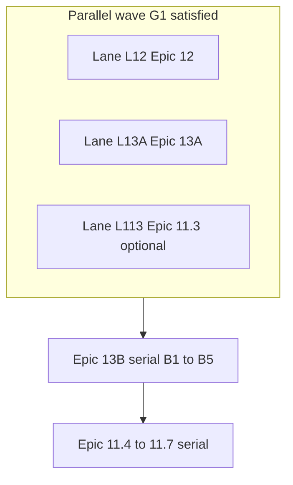
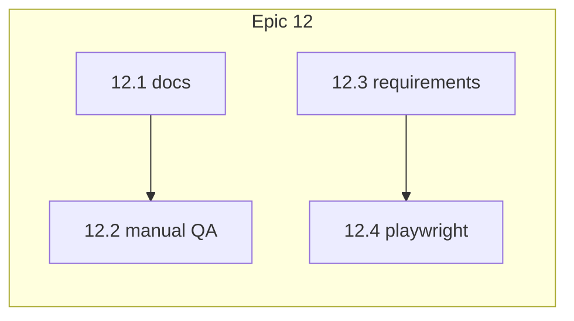
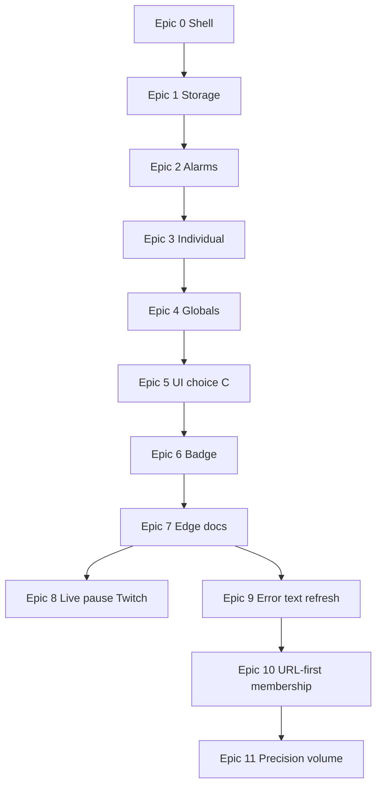

# Media Control Suite — product plan

Manifest V3 Edge extension (**working name;** ships as **Media Control Suite** in user-facing copy): **scheduled tab refresh** — **global groups** (shared interval policy, **per-tab** staggered refresh—not Chrome account sync) vs **individual jobs**, jittered intervals, **target URL per tab**, Side Panel + full-page **dashboard**, and a **focus-aware** toolbar badge — plus **precision in-page volume** (Web Audio; [Epic 11](#epic-11--precision-volume-web-audio)). Unified browse/edit UI opens from the toolbar.

**How to use this doc:** Check off stories (`[x]`) as you ship them. Epics build top-to-bottom (see dependency diagram at the bottom).

**Source of truth:** This file is the canonical checklist for product epics, reference-UI work, and agent-facing scope notes. Cursor (or other) task lists should stay aligned with the checkboxes here—update this doc when scope changes. **Shipped behavior belongs in the epic/story lines** (below); the [Backlog](#backlog-ux--polish--bugs) section tracks follow-ups and may retain a bullet for traceability, but **if the same work is specified under an epic, the epic line is authoritative**—do not maintain a second, diverging spec in the backlog.

---

## Progress overview

| Epic           | Theme                                                                                          | Stories                         |
| -------------- | ---------------------------------------------------------------------------------------------- | ------------------------------- |
| [x] **0**      | Extension shell & entry                                                                        | 3                               |
| [x] **1**      | Data model & persistence                                                                       | 3                               |
| [x] **2**      | Scheduling (service worker)                                                                    | 4                               |
| [x] **3**      | Individual jobs (vertical slice)                                                               | 4                               |
| [x] **4**      | Global groups                                                                                  | 3                               |
| [x] **5**      | Unified UI (choice C)                                                                          | 4                               |
| [x] **6**      | Toolbar badge (focus-aware)                                                                    | 3                               |
| [x] **7**      | Ship notes for Edge                                                                            | 2                               |
| [x] **8**      | Live-aware pause (Twitch-first)                                                                | 3                               |
| [x] **9**      | Blip / error-text triggered refresh                                                            | 3                               |
| [x] **Post-9** | Incremental polish (see [Post–Epic 9](#postepic-9--incremental-enhancements-shipped))          | 6                               |
| [x] **10**     | [URL-first membership](#epic-10--url-first-membership-phased) (phased migration)               | 6                               |
| [ ] **11**     | [Precision volume (Web Audio)](#epic-11--precision-volume-web-audio)                           | 7                               |
| [ ] **12**     | [TwitchFavs / URL-first QA & CI confidence](#epic-12--twitchfavs--url-first-qa--ci-confidence) | 4                               |
| [ ] **13**     | [Scheduler + dashboard modularization](#epic-13--scheduler--dashboard-modularization)          | 13.A1–A3, B1–B5 (+ optional A4) |

_(Optional: set an epic row to `[x]` when **all** its stories are done.)_

**Parallel work (Epics 11–13):** Lanes **L12** ∥ **L13A** ∥ **L113** may run together (distinct paths); **Epic 13.B** and **Epic 11.4+** are **serial** (one PR at a time on hot files). **Epic 11.4–11.7** start only **after Epic 13.B** is complete. See [Parallel work — Epics 11–13](#parallel-work--epics-11-13).

---

## Reference UI + agent guidance (checklist)

Third-party UI (**Auto Refresh Plus**–style screenshots) is **inspiration only**—not our branding. Paths: [`doc/ui-reference/README.md`](../ui-reference/README.md) and `doc/ui-reference/auto-refresh-plus/` (PNG files).

**Work items (check off when done):**

- [ ] **Ref.1** — `doc/ui-reference/auto-refresh-plus/` contains the three reference screenshots (`time-interval-tab.png`, `active-tabs-list.png`, `page-monitor-tab.png`) plus [`doc/ui-reference/README.md`](../ui-reference/README.md) describing each file.
- [x] **Ref.2** — [`.cursor/skills/DESIGN_SYSTEM.md`](../../.cursor/skills/DESIGN_SYSTEM.md) points here for UI inspiration and defers to **Borrow vs exclude** below for scope.
- [x] **Ref.3** — [`.cursor/skills/ui-ux/SKILL.md`](../../.cursor/skills/ui-ux/SKILL.md) and [`.cursor/skills/visual-match/SKILL.md`](../../.cursor/skills/visual-match/SKILL.md) mention `doc/ui-reference/README.md` when matching layout or list density to references.

**Borrow from the reference (our product):**

- Clear **primary action** (Start / Stop) and compact navigation (tabs or sections) so the surface stays scannable.
- **Per-row list** for active work: title or label, **URL**, and a **next-refresh countdown** (maps to our `nextFireAt` / UI tick).
- **Large on-page countdown** (Min / Sec digit tiles) for tabs that have an **active** auto-refresh job—**on by default**, with a **dashboard** toggle (`showPageOverlayTimer` in `chrome.storage.local`). Implemented as a content script + shadow DOM (not third-party “page timer” feature parity).
- Interval UX that maps to our model: **base interval + jitter** (seconds)—we do **not** need the reference’s full preset grid, random min/max, or “specific seconds” radio maze unless we choose to add them later.

**Exclude for Epics 0–7 (do not build to match the reference):**

- Hard refresh (bypass cache), cap on number of refreshes, email alerts, XHR-only refresh mode, account / rate-us / promo footer chrome.
- Full **Page Monitor** parity in the core track—that behavior is **Epic 9** (blip / error-text refresh), not Epic 3–5.

**Map reference → our UI:**

| Reference idea                    | Our plan                                                          |
| --------------------------------- | ----------------------------------------------------------------- |
| “Time Interval” tab               | Dashboard / side panel: interval + jitter fields per job or group |
| “Active Tabs” list                | **Individual** rows (Epic 3+), then **Global** rows (Epic 4+)     |
| Large on-page timer card          | **Epic 3.0** — our overlay + dashboard toggle (default on)        |
| “Page Monitor” (find / lose text) | **Epic 9** — user-defined phrases or regex → trigger refresh      |

---

## Epic 0 — Extension shell and entry point

**Goal:** Installable unpacked extension; toolbar opens the real “settings / overview” surface; Side Panel path exists for choice **C**.

- [x] **0.1** — MV3 `manifest.json`: `background` service worker, `action`, `side_panel`, dashboard/options page, icons, permissions (`storage`, `alarms`, `tabs`, `windows`, `sidePanel`, broad `https` hosts). _Outcome: loads in Edge without errors._
- [x] **0.2** — **Toolbar click → full-page dashboard** as primary overview (not popup-only MVP). _Outcome: icon opens unified browse/edit surface._
- [x] **0.3** — Stub Side Panel path + affordance for “open side panel” (second entry). _Outcome: choice **C** skeleton._

---

## Epic 1 — Data model and persistence

**Goal:** Typed state in `chrome.storage.local`; validation; no double enrollment for the same tab.

- [x] **1.1** — Read/write `GlobalGroup[]` and `IndividualJob[]` (per [data sketch](#data-sketch-illustrative)). _Outcome: survives browser restart._
- [x] **1.2** — Validation helpers: URL (`http`/`https`), positive interval, non-negative jitter, unique ids. _Outcome: bad input rejected before save._
- [x] **1.3** — **Mutual exclusion:** a tab cannot be active in two places (two globals, or global + individual). _Outcome: no double `tabs.update` for the same tab; surface clear errors in dashboard UI as you build Epic 3+._

---

## Epic 2 — Scheduling engine (service worker)

**Goal:** `chrome.alarms` backbone, jittered reschedule, `nextFireAt` in storage, safe tab lifecycle.

- [x] **2.1** — One alarm per **individual** job: on fire → `tabs.update(tabId, { url: targetUrl })`, then reschedule with **base + uniform jitter**. _Outcome: one individual refresh loop works._
- [x] **2.2** — After each schedule, persist **`nextFireAt`** for UI countdowns. _Outcome: storage + alarms stay aligned._
- [x] **2.3** — `tabs.onRemoved` / invalid tab → disable or prune job; `tabs.update` must not throw. _Outcome: clean failure modes._
- [x] **2.4** — **Global group:** ~~one alarm per group; synchronized refresh~~ — **superseded (Post–Epic 9):** one alarm **per tab** in the group with **per-tab jitter** and `tabNextFireAt`; each tab refreshes on its own schedule (see [Post–Epic 9](#postepic-9--incremental-enhancements-shipped)). _Outcome: global membership with staggered refreshes._

---

## Epic 3 — Individual jobs (vertical slice)

**Goal:** First end-to-end workflow without globals.

- [x] **3.0** — **Page overlay timer** — content script shows a large **Min / Sec** countdown on `http`/`https` pages when that tab has an **enabled** individual or global refresh job; **default on**; **dashboard** checkbox turns it off/on (`urlAutoRefresher_prefs_v1`). _Outcome: in-page visibility of time-to-refresh._
- [x] **3.1** — Dashboard: **add Individual job** — pick tab, set `targetUrl`, interval, jitter, Save. _Outcome: first usable path._
- [x] **3.2** — Start / Stop, edit, delete individuals; **one countdown row** per job. _Outcome: full individual lifecycle._
- [x] **3.3** — Extract shared **list row** component for Epic 5. _Outcome: less duplication before Global UI._

---

## Epic 4 — Global groups

**Goal:** Build globals from real windows/tabs; match product model; safe moves vs individuals.

- [x] **4.1** — **Window/tab browser:** `windows.getAll({ populate: true })`, checklist of tabs, per-row `targetUrl`. _Outcome: real multi-window global groups._
- [x] **4.2** — Create / edit / delete globals; **Global (N)** header, shared countdown, group start/stop. _Outcome: globals behave per spec._
- [x] **4.3** — Enforce mutual exclusion when moving a tab between individual and global. _Outcome: safe transitions._

---

## Epic 5 — Unified UI (choice C) and two lists

**Goal:** **Global (N)** and **Individual (M)** everywhere; dashboard + side panel share modules.

- [x] **5.1** — Dashboard: both section headers with counts; browse-all layout. _Outcome: matches **1b** / overview mental model._
- [x] **5.2** — Side Panel: same lists via shared JS/CSS. _Outcome: quick monitoring without full tab._
- [x] **5.3** — Cross-links between surfaces (choice **C**): **Dashboard** shows **Open side panel** (`[data-open-side-panel]` → `chrome.sidePanel.open` for the current window). **Side panel** shows a top-of-body **Open in a tab** control (`[data-open-in-tab]` inside `[data-sidepanel-open-dashboard-row]`) so the full-page dashboard is obvious before scroll; click opens packaged **`dashboard/dashboard.html`** in a new tab (`chrome.tabs.create` via `wireCrossSurfaceLinks()` in [`src/dashboard/dashboard-app.ts`](../../src/dashboard/dashboard-app.ts)). Shared markup in [`dashboard/dashboard.html`](../../dashboard/dashboard.html); [`Scripts/build.mjs`](../../Scripts/build.mjs) generates [`sidepanel/sidepanel.html`](../../sidepanel/sidepanel.html). On the side panel, `[data-surface-nav]` is hidden so there is no duplicate “open dashboard” control. _Outcome: coherent choice **C**; toolbar-first side panel still reaches full-tab dashboard in one click._ **Tier 2:** [`e2e/epic-5.spec.ts`](../../e2e/epic-5.spec.ts) (Epic 5.3 visibility + “Backlog 1”: first body child + tab URL includes `dashboard/dashboard.html`).
- [x] **5.4** — Live countdown in UI (`storage` + `runtime` messages or ~1s polling while visible). _Outcome: rows tick smoothly._

---

## Epic 6 — Toolbar badge (focus-aware)

**Goal:** Badge reflects **focused** window’s timers as far as the platform allows.

- [x] **6.1** — Build **focused-window** job set: `windowId` → relevant individuals + globals touching that window. _Outcome: correct subset for badge math._
- [x] **6.2** — Badge = time to **nearest** `nextFireAt` in that subset; idle (e.g. `×`) when none; optional **fallback** when focused window has no jobs (product decision — document in README). _Outcome: best possible “per-window” feel._
- [x] **6.3** — Subscribe to focus/tab events + alarm completions; avoid busy loops. _Outcome: badge stays current without draining CPU._

---

## Epic 7 — Ship notes for Edge

**Goal:** Someone can install, understand limits, and regress manually.

- [x] **7.1** — README: load unpacked, permissions, **focus-aware badge vs tiled windows** (one shared `chrome.action` badge). _Outcome: install + explain._
- [x] **7.2** — Manual QA script from [Testing checklist (manual)](#testing-checklist-manual) + multi-window scenarios. _Outcome: regression path for releases._

---

## Epic 8 — Live-aware scheduling (Twitch-first)

**Goal:** While a stream is **live**, **pause** the scheduled refresh for that job; when **offline** (no longer live), **resume** the same schedule without making the user recreate the job.

**Product intent:** **Twitch** is the supported use case. The same detection logic may run on other URLs, but **non-Twitch pages are not expected** to behave like Twitch’s live/offline model. If another site happens to align and it works, fine; if users want correct live/offline semantics on arbitrary hosts, treat that as **follow-up bugs or enhancements**, not Epic 8 v1 blockers.

- [x] **8.1** — Detect **live vs offline** on **twitch.tv** (DOM heuristics or documented signals; spike / adjust if Twitch changes markup). _Outcome: reliable signal for our primary use case._
- [x] **8.2** — Integrate with scheduling: when live, **do not fire** the periodic refresh for that job; when offline again, **resume** the alarm loop (implementation detail: e.g. `enabled` vs explicit `pausedForLive`—decide in code; align with `src/background/scheduler.ts`). _Outcome: pause/resume matches stream state._
- [x] **8.3** — Tab close, navigation away from target, and service worker lifecycle: no orphaned alarms; clear UX or logs if detection is unavailable. _Outcome: same robustness as Epic 2 tab lifecycle._

**Technical notes:** Likely requires **content script(s)** on Twitch (and manifest matches); messaging to the service worker. Depends on solid **per-tab individual jobs** (Epic 3+).

---

## Epic 9 — Blip / error-text triggered refresh

**Goal:** After small connectivity blips, specific **words or patterns** sometimes appear on the page; optionally **refresh immediately** when those appear (user-configured strings or regex).

- [x] **9.1** — Per-job (or per-tab) config: **watch phrases and/or regex** (user-defined only). _Outcome: user controls what counts as a “blip” signal._
- [x] **9.2** — **Content script** observes page text (or DOM); on match, message background → **refresh** (`tabs.update` to stored `targetUrl` or reload—align with product rules and mutual exclusion). _Outcome: recovery refresh without waiting for the next alarm._
- [x] **9.3** — **Rate limiting** and loop prevention (debounce, max triggers per minute). _Outcome: no runaway refresh storms._

**Privacy / security:** Only **user-supplied** patterns; no exfiltration. **Permissions:** content scripts + host access as needed.

**Technical notes:** Builds on Epic 3+; similar UX lineage to the reference “Page Monitor” tab, scoped to **our** asks only.

---

## Post–Epic 9 — Incremental enhancements (shipped)

**Goal:** Product polish and model refinements after Epics **8** and **9**; tracked here so requirements/planning stay aligned with `main`.

- [x] **P9.1** — **Global URL patterns:** optional newline-separated patterns with `*` wildcards; open `http`/`https` tabs matching any pattern are included automatically (including tabs opened later). Explicit checkboxes still supported; enrollment validated on save. _Outcome: e.g. all Twitch tabs without manual include each time._
- [x] **P9.2** — **Per-tab pause (global groups):** pause scheduled refresh for one tab in a group (`pausedTabIds`); page overlay shows **Auto refresh paused** + **Play**; compact card when paused. _Outcome: watch one stream without stopping the whole group._
- [x] **P9.3** — **Per-tab jitter for globals:** `tabNextFireAt` + alarm name `urlar:gt:{groupId}:{tabId}`; each tab gets its own base±jitter delay after each refresh (not one shared fire time for the whole group). Dashboard row shows **range** (e.g. `1:00–3:00`) when times differ. _Outcome: staggered refreshes within a group._
- [x] **P9.4** — **Dashboard order:** saved **global group** rows listed **above** the “Add a new group” form. _Outcome: active groups visible without scrolling past the tab browser._
- [x] **P9.5** — **Page overlay polish:** Min/Sec label typography and alignment; timer card position; optional **Pause** for global-group tabs. _Outcome: closer to reference “large timer” UX._
- [x] **P9.6** — **Twitch live bridge robustness:** after extension reload, avoid uncaught **Extension context invalidated** (guard `chrome.runtime`, teardown observers/timers, `unhandledrejection`). _Outcome: clean DevTools when iterating on the extension._

**Requirements detail:** [doc/requirements/post-epic-9.md](../requirements/post-epic-9.md).

---

## Epic 10 — URL-first membership (phased)

**Goal:** Make **`targetUrl` (or a stable member key derived from it)** the durable identity for global group members and individual jobs. **Runtime** still uses `chrome.tabs.update(tabId, …)` — extensions cannot refresh without a tab — but **storage, alarms (as needed), schedule maps, pause state, and enrollment** stop depending on brittle stored **`tabId` / `windowId`**. Ship in **small steps** (commit + `npm run ci` between steps); **no obligation** to keep prior on-disk shapes—use **`schemaVersion`** bump and a single load-time migration when changing persisted fields.

**Why now:** `targetUrl` is already validated everywhere (see [Data sketch](#data-sketch-illustrative)); overlay matching was improved toward URL. Remaining work is scheduler, keys (`tabNextFireAt`, `pausedTabIds`), forms, and exclusivity rules.

**Product rule (decide early):** When **multiple open tabs** match the same member URL, which tab receives the refresh (e.g. last-focused in last-focused window, or lowest tab id). Document in code/tests.

**Implementation order (agents / DLC):** Ship **10.1 → 10.2 → 10.3 → 10.4 → 10.5** in that sequence for the URL-first migration. **10.6 (TwitchFavs)** requires **10.1**; **recommended after 10.2** so scheduler refresh uses resolved tab ids. Details: [doc/requirements/twitch-favs-managed-membership.md](../requirements/twitch-favs-managed-membership.md).

- [x] **10.1** — **Member URL identity (library only):** canonical key helper(s) (e.g. `memberKeyFromTargetUrl`, normalize `www`/path — align with [`page-overlay-state.ts`](../../src/lib/page-overlay-state.ts) ideas) + **pure** “pick best open tab” helper from `chrome.tabs` query results. **Vitest only**; no behavior change in background/UI. _Implemented in [`src/lib/member-url.ts`](../../src/lib/member-url.ts); `pageMatchesExplicitTarget` lives there and is re-exported from [`page-overlay-state.ts`](../../src/lib/page-overlay-state.ts)._

- [x] **10.2** — **Resolve at refresh time:** In [`scheduler.ts`](../../src/background/scheduler.ts) (global + individual paths as needed), resolve **live `tabId`** from stored **`targetUrl`/member key** before `tabs.update` (do not trust stale id as identity). **Optional:** evolve alarm names from `tabId` toward **group/job + member key** in a follow-up commit in this story if needed. _Implemented in [`resolve-live-tab.ts`](../../src/lib/resolve-live-tab.ts) (`resolveLiveTabIdForTargetUrl`), [`global-group-targets.ts`](../../src/lib/global-group-targets.ts) (`resolveGlobalGroupTargets`), and scheduler wiring; Vitest: `resolve-live-tab.test.ts`, `global-group-targets.test.ts`. Legacy tab-rebind helper removed in **10.4**._

- [x] **10.3** — **Schedule + pause keys:** Key **`memberNextFireAt`** (and **`pausedMemberKeys`**) by **`memberKeyFromTargetUrl`**, not `String(tabId)` / legacy `pausedTabIds`. Bump **`schemaVersion`** to **2**; migrate v1 → v2 on load in [`state.ts`](../../src/lib/state.ts) (`normalizeGlobalGroup`). Global alarms: **`urlar:gm:`** + base64url JSON payload ([`alarm-names.ts`](../../src/lib/alarm-names.ts)). **Checkpoint:** pause/resume, countdown, alarms (`npm run ci`).

- [x] **10.4** — **Schema + UI:** Drop persisted **`tabId` / `windowId` from `TargetRef`** (keep field name **`targetUrl`**); update [`global-group-form`](../../src/lib/global-group-form.ts), [`individual-job-form`](../../src/lib/individual-job-form.ts), dashboard/global edit flows, [`global-group-enrollment.ts`](../../src/lib/global-group-enrollment.ts), list row copy. **`schemaVersion` 3** migration in [`state.ts`](../../src/lib/state.ts). **Tier 2:** Playwright epics updated for URL-first storage and overlay seeds.

- [x] **10.5** — **Sweep (URL-first):** Confirmed [`page-overlay-schedule.ts`](../../src/lib/page-overlay-schedule.ts) (URL-only; removed unused `tabId` args), [`tab-lifecycle.ts`](../../src/lib/tab-lifecycle.ts) (no-op by design after 10.4), [`badge.ts`](../../src/background/badge.ts) (focused-window tab URL set + `tabs.onUpdated` when URL changes in the focused window). **Global–global enrollment** now blocks overlap by **member URL key**, not only the same live `tabId` ([`global-group-enrollment.ts`](../../src/lib/global-group-enrollment.ts)).

- [x] **10.6** — **TwitchFavs managed membership:** For the global group whose **name** is **`TwitchFavs`** (case-insensitive), treat **Auto-include URL patterns** as **streamer names** (newline or comma); expand to **`https://www.twitch.tv/{login}`**; **case-insensitive** matching; **prune** stored **`targets`** not on the list; **upsert** `TargetRef` rows (`targetUrl` per channel) on **`tabs.onUpdated`** and on save—when the same channel appears in a **new** tab, drop stale rows that no longer match the managed list (URL-first; no persisted `tabId` on targets). _Implemented in [`twitch-favs.ts`](../../src/lib/twitch-favs.ts), [`global-group-form.ts`](../../src/lib/global-group-form.ts), [`global-group-targets.ts`](../../src/lib/global-group-targets.ts), [`global-group-list-row.ts`](../../src/lib/global-group-list-row.ts), [`twitch-favs-sync.ts`](../../src/background/twitch-favs-sync.ts) (`tabs.onUpdated` debounced → storage + `bootstrapScheduling`); Vitest: `twitch-favs.test.ts`, form/targets/list-row tests; dashboard hint [`dashboard.html`](../../dashboard/dashboard.html) + [`dashboard-app.ts`](../../src/dashboard/dashboard-app.ts). **Requirements:** [doc/requirements/twitch-favs-managed-membership.md](../requirements/twitch-favs-managed-membership.md)._

**Backlog relationship:** **[Backlog #7](#7-global-group--rebinding-when-a-tab-closes-and-reopens-same-url)** (rebind when same URL in a new tab) is **subsumed** by this epic’s URL-first model; after Epic **10** ships, treat **#7** as addressed unless a narrow residual bug remains. **10.6** is the **TwitchFavs-shaped** slice of that behavior for a named group.

---

## Epic 11 — Precision volume (Web Audio)

**Goal:** In-page **granular volume** for `<video>` / `<audio>` via **Web Audio** (`AudioContext`, `MediaElementSource`, `GainNode`), **keyboard shortcuts**, and **dashboard/side panel** controls—without breaking the existing **page overlay** countdown ([`src/content/page-overlay.ts`](../../src/content/page-overlay.ts)).

**Execution order vs [Epics 12–13](#parallel-work--epics-11-13):** Hold **11.4–11.7** until **[Epic 13.B](#epic-13--scheduler--dashboard-modularization)** is complete so volume messaging and dashboard UI land on the **post-refactor** dashboard. **11.3** (dynamic media) may run in parallel lane **L113** with **L12** / **L13A** if paths stay isolated—do not grow [`dashboard-app.ts`](../../src/dashboard/dashboard-app.ts) for **11.5** until **13.B** ships (**G3**). Do not renumber Epic 11; only **execution order** changes.

**Recommended sequencing vs Epic 10:** Ship **after [Epic 10](#epic-10--url-first-membership-phased)** (or at least **10.1–10.3**) when possible—both epics touch **content scripts**, **messaging**, and **overlay-adjacent** code. If volume must land sooner, isolate **new modules + new message types** and avoid mixing with Epic **10** migration PRs.

**Requirements detail:** [doc/requirements/precision-volume-controller.md](../requirements/precision-volume-controller.md).

- [x] **11.1** — **`manifest.json` + build:** Add **`chrome.commands`** (increase / decrease / panic mute) and any **minimal** new permissions; extend [`Scripts/build.mjs`](../../Scripts/build.mjs) if a new content bundle is required. _Outcome: extension loads; commands registered._ _Implemented: [`manifest.json`](../../manifest.json) `commands`; [`volume-commands.ts`](../../src/background/volume-commands.ts) → [`precision-volume-bridge.ts`](../../src/content/precision-volume-bridge.ts) (imported from [`page-overlay.ts`](../../src/content/page-overlay.ts)); message [`PRECISION_VOLUME_COMMAND`](../../src/lib/messages.ts)._

- [x] **11.2** — **Content hook:** On matching media, create **one** `MediaElementSource` per element (guard against double-hook), **zero-blast** initial gain, connect through `GainNode` to destination; handle **CORS** limits per [web-audio-dsp](../../.cursor/skills/web-audio-dsp/SKILL.md). _Outcome: safe attach without duplicate-source crashes._ _Implemented: [`precision-volume-bridge.ts`](../../src/content/precision-volume-bridge.ts); primary pick [`precision-volume-primary.ts`](../../src/lib/precision-volume-primary.ts); gain steps [`precision-volume-gain.ts`](../../src/lib/precision-volume-gain.ts); Vitest in `precision-volume-_.test.ts`.\*

- [ ] **11.3** — **Dynamic media:** **`MutationObserver`** (or equivalent) attaches to **new** media elements after SPA navigation. _Outcome: YouTube-style navigations pick up new players._

- [ ] **11.4** — **Messaging:** Typed messages in [`src/lib/messages.ts`](../../src/lib/messages.ts); background routes **set gain** / mute to the correct tab’s content handler; use **ramped** gain updates. _Outcome: dashboard can drive live volume._

- [ ] **11.5** — **Dashboard + side panel UI:** Log **fader** (precision at low end), **numeric** input (decimals + negative = phase invert label), **Shift** for 10× finer drags; persist prefs (extend or nest under [`prefs.ts`](../../src/lib/prefs.ts) pattern). _Outcome: unified surfaces control volume like the rest of choice **C**._

- [ ] **11.6** — **Shortcuts + OSD:** Background handles **`chrome.commands`**; content shows **transient OSD** (~2s) with current level when shortcuts fire. _Outcome: keyboard feedback without opening the dashboard._

- [ ] **11.7** — **Tests:** **Vitest** for slider ↔ gain math; **Playwright** where user-visible strings or toggles need regression cover. _Outcome: `npm run ci` stays green._

---

## Parallel work — Epics 11–13

**Goal:** Ship **Epic 12** and **Epic 13** without merge roulette on [`dashboard-app.ts`](../../src/dashboard/dashboard-app.ts) or [`scheduler.ts`](../../src/background/scheduler.ts), while still allowing **parallel work** where paths do not overlap.

### Hard merge gates

| Gate   | Rule                                                                                                                                                                                                                                                         |
| ------ | ------------------------------------------------------------------------------------------------------------------------------------------------------------------------------------------------------------------------------------------------------------ |
| **G1** | **Epic 13.B** starts only after **Epic 13.A** is complete (through **13.A3**; **13.A4** optional before or during early **13.B1** if tiny).                                                                                                                  |
| **G2** | **Epic 11.4 → 11.7** start only after **Epic 13.B** is complete (all slices merged). Volume work lands on the **post-refactor** dashboard layout.                                                                                                            |
| **G3** | **Never** have two open PRs that both edit **[`dashboard-app.ts`](../../src/dashboard/dashboard-app.ts)** for **different epics** (e.g. one **13.B** + one **11.5**). **One owner** for that file at a time.                                                 |
| **G4** | **Never** parallel **Epic 13.B** stories: run **13.B1 → … → 13.B5** as **one PR at a time** (serial).                                                                                                                                                        |
| **G5** | **Within L13A**, at most **one** open PR that edits [`scheduler.ts`](../../src/background/scheduler.ts) (or new `scheduler-*.ts` extracts) at a time—ship **13.A1 → 13.A2 → 13.A3** **serial**. **L12** / **L113** may still merge **between** those merges. |

### Approved parallel lanes

| Lane     | Epic / scope       | Typical paths                                                                                                                                       | Branch prefix example |
| -------- | ------------------ | --------------------------------------------------------------------------------------------------------------------------------------------------- | --------------------- |
| **L12**  | Epic **12**        | `doc/**`, [`e2e/`](../../e2e/), [`doc/requirements/`](../../doc/requirements/)                                                                      | `feature/epic-12-…`   |
| **L13A** | Epic **13.A**      | [`src/background/scheduler.ts`](../../src/background/scheduler.ts) + new `scheduler-*.ts`                                                           | `feature/epic-13a-…`  |
| **L113** | Epic **11.3** only | [`precision-volume-bridge.ts`](../../src/content/precision-volume-bridge.ts), [`page-overlay.ts`](../../src/content/page-overlay.ts) wiring, Vitest | `feature/epic-11-3-…` |

**Lanes L12, L13A, and L113** may run in parallel from the first mergeable slice onward. **Within L13A**, still run **13.A1 → 13.A2 → 13.A3** one PR at a time (**G5**). **Merge to `main` one PR at a time** through CI (rebases are normal—avoid two PRs touching the same file).

**Optional:** If parallel still feels noisy for your team, **park L113** and ship **11.3** after **13.A**; gates above stay the same.

### Single agent / single stream

Use a **linear** order: **12.1–12.3 → 13.A1 → 12.4 → 13.A2 → 13.A3 → (optional 11.3) → 13.B1 → … → 13.B5 → 11.4 → … → 11.7**. Parallel lanes are optional when only one contributor is active.

**Quality:** After each **13.B** slice, run ESLint complexity on touched files; optionally tighten caps in [`eslint.config.mjs`](../../eslint.config.mjs) when functions drop under thresholds (see [.cursor/skills/code-quality-gate/SKILL.md](../../.cursor/skills/code-quality-gate/SKILL.md)).



---

## Epic 12 — TwitchFavs / URL-first QA & CI confidence

**Goal:** Make TwitchFavs behavior **observable and testable** for real profiles and for **CI** (deterministic). Epic **12** does not require Epic **11**; lane **L12** may parallel **L13A** / **L113** (see [Parallel work — Epics 11–13](#parallel-work--epics-11-13)).

**Tester context (align with product):** After **[Epic 10.4](#epic-10--url-first-membership-phased)**, [`TargetRef`](../../src/lib/types.ts) persists **`targetUrl` only** (no stored `tabId`). **Live `tabId`** is resolved at runtime ([`resolveGlobalGroupTargets`](../../src/lib/global-group-targets.ts), [`resolveLiveTabIdForTargetUrl`](../../src/lib/resolve-live-tab.ts)). **[`applyTwitchFavsUpsertFromTabUrl`](../../src/lib/twitch-favs.ts)** collapses **`globalGroups[].targets`** to **one canonical row per channel** when a matching Twitch tab updates; **[`attachTwitchFavsTabListener`](../../src/background/twitch-favs-sync.ts)** debounces `tabs.onUpdated` → `saveAppState` → `bootstrapScheduling()`. Normative TF behavior: [doc/requirements/twitch-favs-managed-membership.md](../requirements/twitch-favs-managed-membership.md) (**TF.5–TF.7** updated for URL-first in **12.3**).

**What “tab id changed” means for manual QA:** After close/reopen, the **new** tab gets a new Chrome `tabId`, but **storage** should still show the **same channel `targetUrl` row**; refresh/overlay should follow the **new** tab because resolution re-runs from URLs + open tabs—not because `tabId` was rewritten in `chrome.storage.local`.

### Epic 12.1 — Tester mental model (Extension Storage, URL-first)

Use **Edge DevTools** on a profile where the extension is loaded (**Application** → **Storage** → **Extension** → this extension).

1. **App state key:** Open **`urlAutoRefresher_state_v1`** (see [`STORAGE_KEY`](../../src/lib/storage.ts)). Parsed JSON includes **`globalGroups`** and **`individualJobs`**.
2. **TwitchFavs `targets`:** Each member row is a **`TargetRef`**: **`targetUrl`** (canonical `https://www.twitch.tv/{login}` for managed channels) and optional **`label`**. Do **not** expect persisted **`tabId`** / **`windowId`** on those rows after Epic **10.4**.
3. **Per-member schedule / pause:** For globals, keys under **`memberNextFireAt`** and **`pausedMemberKeys`** use the same **member key** as `memberKeyFromTargetUrl(targetUrl)` (not Chrome tab ids). Legacy fields may still appear until a save/migration path rewrites them; trust the types in [`src/lib/types.ts`](../../src/lib/types.ts) for new writes.
4. **Prefs:** Overlay and other UI prefs live under **`urlAutoRefresher_prefs_v1`** ([`PREFS_STORAGE_KEY`](../../src/lib/prefs.ts))—separate from job state.
5. **Inferring the “right” tab:** If a channel tab is open and the group is **enabled**, the **page overlay** (when the pref is on) and **scheduled refresh** should attach to the **live** tab that resolves for that **`targetUrl`** (see product rule for multiple matching tabs in [Epic 10](#epic-10--url-first-membership-phased)). During development, re-read **`urlAutoRefresher_state_v1`** after Twitch navigations, or add temporary logging on `chrome.storage.onChanged` in the service worker.

### Epic 12.2 — Manual checklist (TwitchFavs, real profile)

**Prereq:** `npm run build`, load **unpacked** extension, use a normal Edge profile (cookies / Twitch login as you usually would).

1. **Create the managed group:** On the dashboard, add a **global** group whose **name** is **`TwitchFavs`** (any casing, e.g. `twitchfavs`). In **Auto-include URL patterns**, enter **streamer logins** (comma or newline) for channels you can open. Set interval/jitter, **Save**, then **Start** the group (**enabled**).
2. **Open a favorite channel:** Open `https://www.twitch.tv/{login}` in a tab for one of those logins. Wait a moment or trigger navigation so `tabs.onUpdated` runs.
3. **Inspect storage:** In DevTools, confirm under **`urlAutoRefresher_state_v1`** → `globalGroups[]` for this group: **`targets`** contains **one** object for that channel with **`targetUrl`** = canonical Twitch URL and **no** stored tab id on the row (per **12.1**).
4. **Overlay + schedule:** With overlay pref on and the group running, confirm the **large countdown overlay** appears on that tab (or use dashboard row countdown). Note **`memberNextFireAt`** keys if you want to correlate schedule state.
5. **Close the channel tab completely** (tab closed, not only navigating away).
6. **Open the same channel again** in a **new** tab (new `tabId`).
7. **Re-verify:** Storage should still show the **same** canonical **`targetUrl`** row (not duplicate rows for the same channel). Overlay and refresh behavior should apply to the **new** tab without re-saving the group manually.
8. **Optional:** Remove a streamer from the pattern list, **Save**, and confirm **TF.5** pruning (row disappears for that channel).

Regression pointers: [doc/requirements/twitch-favs-managed-membership.md](../requirements/twitch-favs-managed-membership.md) **TF.5–TF.7**; Tier 2 automation for this flow is **12.4**.

- [x] **12.1** — **Docs — tester mental model:** [§ Epic 12.1](#epic-121--tester-mental-model-extension-storage-url-first); mirrored in [TEST_PLAN.md](../../TEST_PLAN.md) Tier 2 manual.
- [x] **12.2** — **Manual checklist:** [§ Epic 12.2](#epic-122--manual-checklist-twitchfavs-real-profile); linked from [Testing checklist (manual)](#testing-checklist-manual).
- [x] **12.3** — **Requirements hygiene:** **TF.5** / **TF.6** (and TF.7 unchanged) in [`twitch-favs-managed-membership.md`](../requirements/twitch-favs-managed-membership.md) aligned with URL-first storage and upsert behavior.
- [x] **12.4** — **Deeper Playwright (CI-safe):** **(a)** [`e2e/epic-12-4.spec.ts`](../../e2e/epic-12-4.spec.ts) — Playwright **route interception** for `https://www.twitch.tv/{login}` with a minimal local document; asserts **`urlAutoRefresher_state_v1`** gains the canonical **`targets`** row after service-worker debounce. **(b)** [`src/background/twitch-favs-sync.test.ts`](../../src/background/twitch-favs-sync.test.ts) — Vitest for exported **`persistTwitchFavsUpsertFromTabUrl`** (orchestration used by `attachTwitchFavsTabListener`). **(c)** Optional real-Twitch Tier 2: not added; if you add **`E2E_TWITCH_LIVE=1`** gated specs, document in [TEST_PLAN.md](../../TEST_PLAN.md) and keep them **out of default CI**. Re-read [.cursor/skills/chromium-mv3-extension/SKILL.md](../../.cursor/skills/chromium-mv3-extension/SKILL.md) before changing manifest, service worker wiring, or messaging.

**Dependency note:** Epic **12** is orthogonal to **11.3** (content) and **13.A** (scheduler).



---

## Epic 13 — Scheduler + dashboard modularization

**Goal:** Reduce complexity and file size of [`initDashboardApp`](../../src/dashboard/dashboard-app.ts) (~800+ lines) and [`onAlarmFired`](../../src/background/scheduler.ts) / surrounding scheduler (~400+ lines in one file) **without behavior change**—each story ends with **`npm run ci` green** and preferably **one focused PR**. See [Parallel work — Epics 11–13](#parallel-work--epics-11-13) for **G1–G5** and lanes.

### Phase A — Scheduler

**Shipped:**

- [x] **13.A1** — State alignment in [`src/background/scheduler-align-state.ts`](../../src/background/scheduler-align-state.ts); Tier 1 [`src/background/scheduler-align-state.test.ts`](../../src/background/scheduler-align-state.test.ts).
- [x] **13.A2** — Alarm sync in [`src/background/scheduler-sync-alarms.ts`](../../src/background/scheduler-sync-alarms.ts); Tier 1 [`src/background/scheduler-sync-alarms.test.ts`](../../src/background/scheduler-sync-alarms.test.ts); [`scheduler.ts`](../../src/background/scheduler.ts) re-exports **`syncAlarmsWithState`** for existing callers.
- [x] **13.A3** — Alarm handlers in [`src/background/scheduler-alarm-handlers.ts`](../../src/background/scheduler-alarm-handlers.ts) (`handleIndividualJobAlarm`, `handleGlobalMemberAlarm`, **`dispatchSchedulerAlarm`**); Tier 1 [`src/background/scheduler-alarm-handlers.test.ts`](../../src/background/scheduler-alarm-handlers.test.ts); [`scheduler.ts`](../../src/background/scheduler.ts) routes badge tick + **`dispatchSchedulerAlarm`**, re-exports **`syncAlarmsWithState`**.

| Story     | Extract (suggested new module under `src/background/` or `src/lib/`)                                                                                                   | Notes                                                                                                                                           |
| --------- | ---------------------------------------------------------------------------------------------------------------------------------------------------------------------- | ----------------------------------------------------------------------------------------------------------------------------------------------- |
| **13.A1** | **State alignment:** `alignIndividualJobsState`, `alignGlobalGroupsState`, `alignAppState`, `baseAndJitterMs`, `memberNextFireAtSig` → e.g. `scheduler-align-state.ts` | Mostly deterministic; `alignGlobalGroupsState` calls `resolveGlobalGroupTargets`—Vitest can mock `chrome.tabs.query` if needed.                 |
| **13.A2** | **Alarm sync:** `clearOurAlarms`, `stateSchedulingEqual`, loop in `syncAlarmsWithState` → e.g. `scheduler-sync-alarms.ts`                                              | Keep public **`syncAlarmsWithState`** stable for callers.                                                                                       |
| **13.A3** | **Alarm handlers:** split `onAlarmFired` into e.g. `handleIndividualJobAlarm`, `handleGlobalMemberAlarm` in `scheduler-alarm-handlers.ts`                              | Keep [`scheduler.ts`](../../src/background/scheduler.ts) as thin router + exports `bootstrapScheduling`, `onAlarmFired`, `syncAlarmsWithState`. |
| **13.A4** | **Tab lifecycle entrypoints** (`onTabRemoved`, etc.) if still colocated                                                                                                | Optional if already small after A1–A3.                                                                                                          |

### Phase B — Dashboard

**Shipped:**

- [x] **13.B1** — Shell: [`src/dashboard/dashboard-shell.ts`](../../src/dashboard/dashboard-shell.ts) (`DashboardDom`, `DashboardContext`, `createDashboardContext`, `bindOverlayPreference`, `wireCrossSurfaceLinks`); Tier 1 [`src/dashboard/dashboard-shell.test.ts`](../../src/dashboard/dashboard-shell.test.ts) (jsdom); [`dashboard-app.ts`](../../src/dashboard/dashboard-app.ts) owns one **`dashboardContext`** for shell wiring.

`initDashboardApp` is one large closure over DOM nodes and `cachedIndividualTabs`. Refactors should introduce a **single context object** (or small module-level registry) passed into binders so extracted files do not rely on implicit outer scope. After each **13.B** slice: keep **Tier 2** [`e2e/epic-3-2.spec.ts`](../../e2e/epic-3-2.spec.ts), [`e2e/epic-4-3.spec.ts`](../../e2e/epic-4-3.spec.ts) green.

| Story     | Extract                                                                                                                                  | Notes                                                                                                          |
| --------- | ---------------------------------------------------------------------------------------------------------------------------------------- | -------------------------------------------------------------------------------------------------------------- |
| **13.B1** | **Shell:** `wireCrossSurfaceLinks`, overlay pref block                                                                                   | Establishes `DashboardDom` / `DashboardContext` type pattern.                                                  |
| **13.B2** | **Individual list + jobs events:** `renderIndividualJobs`, `tickCountdowns` (partial), `bindJobsListEvents`, add-job form submit         | Largest user-visible risk.                                                                                     |
| **13.B3** | **Tab browser + individual selectors:** `refreshCachedTabs`, `populateTabSelect`, filters, `syncIndividualTargetUrlFromSelectedTab`      | Extract shared **tab cache** helpers if duplication appears.                                                   |
| **13.B4** | **Global groups:** `renderGlobalGroupsList`, `bindGlobalGroupsListEvents`, global form submit, `renderGlobalTabBrowser` / search filters | Heavy; consider **13.B4a** / **13.B4b** if one PR is too large.                                                |
| **13.B5** | **Storage listener + interval tick wiring** in e.g. `dashboard-storage-sync.ts`                                                          | Centralizes `onlyNonLayoutAppStateDiff` with `renderIndividualJobs` / `tickCountdowns`—avoid circular imports. |

**Definition of done (roadmap doc):** EDGE + PM_PLAN list Epics **12** and **13**, gates, and lanes; dependency [diagram below](#dependency-diagram) includes the **parallel wave** then **serial 13.B** then **serial 11.4+**. Each merged story: **`npm run ci`** per [AGENT_HANDOFF.md](../../AGENT_HANDOFF.md). No product behavior change for Epic **13** unless a bug is fixed in isolation with a test.

---

## Reference — goals vs approach

| Requirement                            | Approach                                                                                             |
| -------------------------------------- | ---------------------------------------------------------------------------------------------------- |
| Install in Edge                        | MV3; load unpacked or publish to Edge Add-ons.                                                       |
| Refresh a **fixed target URL** per tab | Store `targetUrl` per tab; tick → `chrome.tabs.update(tabId, { url: targetUrl })`.                   |
| Base interval + jitter                 | `nextDelayMs = baseMs + uniform offset in [-jitterMs, +jitterMs]`; reschedule after each fire.       |
| Icon shows status                      | **Focus-aware** badge (nearest `nextFireAt` for **focused** window’s jobs); full UI lists every job. |
| Multi-window, one place                | `chrome.storage` + `windows.getAll({ populate: true })` when picking targets.                        |

---

## Reference — Toolbar, badge, settings

- **Toolbar click** opens the **full-page dashboard** (browse every global set and individual job).
- **Product goal:** Badge feels tied to the **focused** window — recompute on `windows.onFocusChanged` / `tabs.onActivated`: nearest `nextFireAt` among jobs for that window (individuals in that window + globals that include a tab there). Compact text (e.g. minutes or `m:ss`); idle (e.g. `×`) when no jobs. Optional fallback if focused window has no jobs: nearest refresh **across all** jobs (document in README).
- **Platform limit:** `chrome.action` has **one** badge per profile — all toolbars show the **same** text; tiled windows still mirror the **focused** window’s countdown, not two different numbers. Per-window numbers without hacks would need e.g. a content-script overlay (out of scope unless you add it later).
- Full per-row countdowns live in **Side Panel + dashboard** (choice **C**).

---

## Reference — Clarifications (1, 1a–1c)

- **Global vs Individual:** From any window, choose **Global** (shared clock for included tabs) or **Individual** (separate timers). Same data via `chrome.storage`.
- **1a:** **Global** groups use **per-tab** alarms and `tabNextFireAt` (Post–Epic 9); tabs in a group refresh on **staggered** schedules with shared interval/jitter **parameters**. **Individual** jobs have one alarm + `nextFireAt` each.
- **1b:** UI always shows **Global (N)** and **Individual (M)** with counts.
- **1c:** Every row shows a **next-refresh** countdown (one per global group; one per individual). Badge uses focus-aware rules above.

---

## Reference — Core product model (short)

1. **Global groups** — Named targets + optional URL patterns; **one interval+jitter policy** per group; each tab has its **own** next-fire time (staggered); each refresh uses that tab’s stored `targetUrl`.
2. **Individual jobs** — Own schedule; edits don’t affect globals.
3. **Two lists everywhere** — Same structure in Side Panel and dashboard.
4. **UI mode** — Clear Global vs Individual flow; **at most one** active enrollment per `tabId` (global or individual).

---

## Reference — Scheduling (MV3-safe)

- **`chrome.alarms`:** one alarm per **individual** job; **one alarm per (global group, tab)** for globals (`urlar:gt:` prefix). Legacy single-group alarms (`urlar:g:`) are cleared on sync.
- On fire: run refresh for that tab, compute **per-tab** delay with jitter, recreate that tab’s alarm.
- **`nextFireAt`** (individuals) and **`tabNextFireAt`** (globals) in storage for UI; optional short-interval tick **only while** a surface is visible — alarms + stored times remain source of truth.

---

## Reference — Permissions

- `storage`, `alarms`, `tabs`, `windows`, `sidePanel`
- Host: `http://*/*`, `https://*/*` (or `<all_urls>`) for arbitrary navigation targets.

---

## Reference — UI deliverables (choice C)

1. **Side Panel** — Both lists, counts, countdowns, start/stop; `chrome.sidePanel.setOptions` + entry affordances as needed.
2. **Full-page dashboard** — Same model; more room for editing targets, URLs, intervals, jitter, membership.

Shared: one module for list rendering + validation (URL, interval, jitter).

---

## Data sketch (illustrative)

```ts
/** `label` is optional metadata for future UI (Epics 0–7 do not require showing or editing it). */
type TargetRef = { tabId: number; windowId: number; targetUrl: string; label?: string };

type GlobalGroup = {
  id: string;
  name: string;
  targets: TargetRef[];
  urlPatterns?: string[];
  pausedTabIds?: number[];
  baseIntervalSec: number;
  jitterSec: number;
  enabled: boolean;
  /** Legacy; prefer tabNextFireAt. */
  nextFireAt?: number;
  tabNextFireAt?: Record<string, number>;
};

type IndividualJob = {
  id: string;
  target: TargetRef;
  baseIntervalSec: number;
  jitterSec: number;
  enabled: boolean;
  nextFireAt?: number;
  liveAwareRefresh?: boolean;
  streamLive?: boolean;
  blipWatchPhrases?: string[];
  blipWatchRegex?: string;
  blipMaxPerMinute?: number;
};
```

Enforce **non-overlap:** same `tabId` cannot be enabled in two places.

---

## Edge packaging

- **Load unpacked** from `edge://extensions` with Developer mode.
- Same ZIP/CRX flow as Chrome if you publish to [Microsoft Edge Add-ons](https://microsoftedge.microsoft.com/addons/Microsoft-Edge-Extensions-Home).

---

## Testing checklist (manual)

- [ ] **TwitchFavs URL-first (Epic 12.2):** Run the steps in [Epic 12 — § Epic 12.2](#epic-122--manual-checklist-twitchfavs-real-profile) (close channel tab → reopen same channel in a **new** tab; overlay + schedule on **live** tab; storage stays URL-first per **TF.5–TF.7**). Requirements: [twitch-favs-managed-membership.md](../requirements/twitch-favs-managed-membership.md).
- [ ] Two windows, two different `targetUrl`s in **one global group** → both refresh **together**; live URL may differ until refresh.
- [ ] **Individual** in window A while **global** runs in B/C → independent timers.
- [ ] Service worker restarts → alarms still fire; `nextFireAt` matches alarms.
- [ ] Tab closed → job disabled or removed; no error on `tabs.update`.

---

## Out of scope / follow-ups

- **Different badge text on two visible windows at once:** not supported by `chrome.action`; optional later: per-tab overlay (content script).

---

## Backlog (UX / polish / bugs)

Tracked here until scheduled into an epic or story. **Normative shipped scope** for a capability also listed under an epic lives in that **epic checklist** (see **Source of truth** at the top)—backlog lines here stay for traceability or work not yet folded into an epic.

1. **Side panel — open full dashboard in a tab** — _(Shipped; see **Epic 5.3** for acceptance, files, and tests.)_ Originally a UX polish follow-up (toolbar opens side panel first); implementation is part of unified UI / cross-links.

2. **Overlay timer — compact layout** — _(Shipped.)_ No separate Min/Sec labels; digit tiles ~75% of prior size; **Pause** left with **mm:ss** readout beside on one row (`src/content/page-overlay.ts`; Tier 2: `e2e/extension.spec.ts`).

3. **Overlay paused state — compact** — _(Shipped.)_ **Play** ~75% prior control size, **inline to the right** of “Auto refresh paused” on one row (`.paused-compact-row` in `src/content/page-overlay.ts`; Tier 2: `e2e/extension.spec.ts`).

4. **Play (resume) sometimes no-ops after long idle** — _(**Status: on hold** — **hard to replicate**; resume when a reliable repro or root cause exists.)_ After several minutes paused, **Play** may do nothing when clicked. **Treat as a suspected bug** (MV3 service worker sleep / message delivery) when investigated; **investigation ideas:** retry `sendMessage`, `chrome.runtime.connect` keep-alive, or explicit SW wake before handling `GLOBAL_GROUP_TAB_PAUSE` / `INDIVIDUAL_JOB_OVERLAY_PAUSE`. **Not the same as item 5:** if DevTools shows **Extension context invalidated** at `page-overlay.js`, that is usually **extension reload** while the tab stayed open — see item **5** (shipped). Item **4** is intermittent idle behavior, not that scenario.

5. **Page overlay — “Extension context invalidated” on pause / resume / sync** — _(Shipped for overlay.)_ `sendMessage` can **throw synchronously** after reload/update while the host page still runs the old content script; promise `.catch()` does not catch that. **Implementation:** [`src/lib/extension-runtime-send.ts`](../../src/lib/extension-runtime-send.ts) (`sendExtensionMessageFireAndForget`, `sendExtensionMessageAsync`) used from [`src/content/page-overlay.ts`](../../src/content/page-overlay.ts); dead context removes overlay + blip watcher instead of throwing. Tier 1: `src/lib/extension-runtime-send.test.ts`. **Related:** [Post–Epic 9 **P9.6**](#postepic-9--incremental-enhancements-shipped) (Twitch live bridge).

6. **Global group — edit: add / remove member URLs (tabs) after creation** — _(Shipped.)_ **Edit** exposes **Member tabs** with a **green “+”** (`data-global-edit-add-target`, `aria-label="Add tab to group"`) to append an open-tab row, **red “×”** per row to remove, and **Save** collects membership in DOM order. New rows use tab picker + target URL; [`buildGlobalGroupUpdateFromForm`](../../src/lib/global-group-form.ts) accepts a variable-length target list and filters `pausedTabIds` / `tabNextFireAt` to remaining tab ids. **Tier 2:** [`e2e/epic-4-2.spec.ts`](../../e2e/epic-4-2.spec.ts) (Epic 4.2b). **Files:** [`src/dashboard/dashboard-app.ts`](../../src/dashboard/dashboard-app.ts), [`src/lib/global-group-list-row.ts`](../../src/lib/global-group-list-row.ts).

7. **Global group — rebinding when a tab closes and reopens (same URL)** — _(**Superseded by [Epic 10](#epic-10--url-first-membership-phased)** — URL-first membership removes dependence on stored `tabId` for logical identity; use Epic 10 stories instead of a one-off rebind patch.)_ ~~Membership is stored by **`tabId`** (and `windowId`). If the user **closes** a tab that belongs to a group and **opens the same URL again**, the new tab gets a **new `tabId`**; the group still references the **old** id, so scheduled refresh no longer targets the visible tab.~~
   - **User scenario (example):** A tab for `https://www.twitch.tv/me` is in global group `twitchrefresh`. The user closes that tab and opens the same channel again (new tab). The new tab should be **treated as the same logical member**: alarms, `tabNextFireAt`, overlay, and per-tab rules (e.g. `pausedTabIds`, jitter) should apply to the **new** `tabId` without forcing the user to remove/re-add the tab or re-save the group.

   - **Relation to P9.1 (URL patterns):** P9.1 auto-includes **open** tabs whose URL matches a group’s patterns at save/enrollment time. That does **not** by itself fix a **stale `tabId`** after the user **closed** the only matching tab: the stored target can still point at a dead id. Backlog **7** closes that gap by **rebinding** when a matching tab appears again.

   - **Outcome:** When a tab appears whose URL resolves to the same enrolled **target URL** / pattern as an existing member (or replaces a member whose tab was removed), **rebind** the group’s stored target to the new `tabId` (and current `windowId`) so refresh and rules follow the visible tab.

   - **Edge cases (design before ship):** Two or more open tabs with the same URL — decide which id wins (e.g. last-focused, most recently created, or do not steal until only one match). Document the rule in the PR and tests.

   - **Likely touch:** [`src/lib/tab-lifecycle.ts`](../../src/lib/tab-lifecycle.ts) (tab removed already clears/disables in some paths), [`src/background/scheduler.ts`](../../src/background/scheduler.ts), [`src/lib/global-group-targets.ts`](../../src/lib/global-group-targets.ts) or equivalent **attach** / **tabs.onCreated** / **onUpdated** flow — design carefully to avoid stealing unrelated tabs with the same URL.

8. **Page overlay — position: avoid blocking host UI (left/right vs drag)** — The overlay is fixed **top-right**; users may need to reach a **control on the page** that sits underneath.
   - **User scenario (example):** On **Twitch** (and similar dense UIs), the auto-refresh overlay can sit on top of **information or buttons** the user still needs. Example: **chat is minimized** to the side; the control to **expand / unhide** chat can end up **under the overlay**. Because the user **cannot move** the overlay today, they cannot reach the control without disabling the overlay or zooming the page — **snap** (left/right) or **drag** (see below) addresses this class of problem.

   - **Options to explore (not mutually exclusive):** (a) a control to **snap** the card between **left** and **right** (and back); (b) **user-draggable** overlay so they can move it aside, with optional **persistence** (e.g. `chrome.storage` per origin or global pref) so after **refresh** it returns near the last position or a defined default; (c) reset-to-default on each load vs remember — decide in UX.

   - **Likely touch:** [`src/content/page-overlay.ts`](../../src/content/page-overlay.ts) (shadow DOM + CSS), prefs in [`src/lib/prefs.ts`](../../src/lib/prefs.ts) if persisted.

---

## Dependency diagram

**Shipped sequence (Epics 0–10):**



Epic **8** and **9** follow **Epic 7** on the roadmap. **Technically** they need stable **per-tab jobs** (Epic 3) and benefit from **unified UI** (Epic 5); treat **Epic 7** as the quality gate before heavy **content-script** work. **Epic 10** refactors stored membership toward **URL-first** identity; it **depends** on the current scheduling/UI baseline (through Epic **9** / Post–9) and **replaces** ad-hoc “rebind tab id” work ([Backlog #7](#7-global-group--rebinding-when-a-tab-closes-and-reopens-same-url)). **Epic 11** adds **Web Audio** volume and shortcuts; it **depends** on the unified UI baseline (Epic **5**) and is **recommended after Epic 10** to reduce merge risk with overlay/scheduler work.

**Execution after Epic 10 (Epics 11–13 — parallel wave, then serial 13.B, then serial 11.4+):** same diagram as [Parallel work — Epics 11–13](#parallel-work--epics-11-13) (mermaid **flowchart TB** with `wave1` → **Epic 13.B** → **Epic 11.4–11.7**). Epic **12** runs in lane **L12** in the first wave; **Epic 13.A** in **L13A**; **Epic 11.3** optionally in **L113**.
